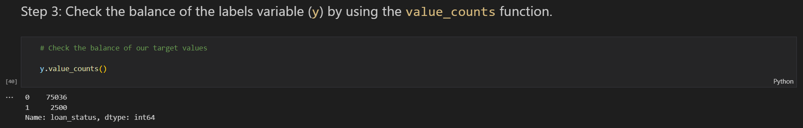
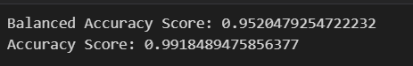
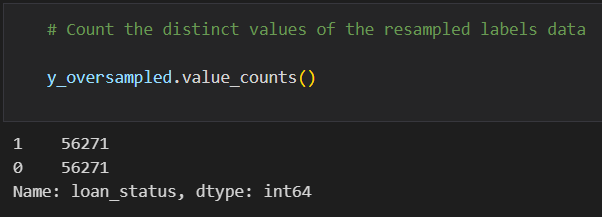
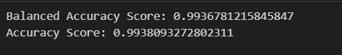
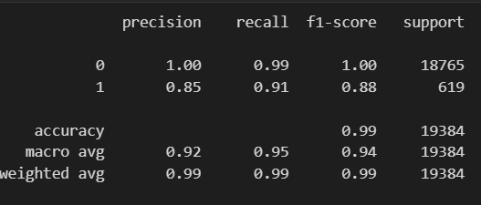
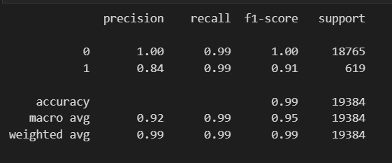

# credit-risk-classification

In this Repo: 

* The folder Resources contains the csv file used for the analysis. 
* The "credit_risk_classification.ipynb" is the main script of the analysis.
* The README file provides the  "Credit Risk Analysis Report".

## Overview of the Analysis

The purpose of the analysis is to train and evaluate a model based on loan risk to identify the creditworthiness of borrowers. A dataset of historical lending activity from a peer-to-peer lending services company is provided to build the model.

In this analysis, the data was split in to training and testing sets. Then the dependent variable (loan status) and independent variables (all columns except loan status) were declared. Then, two different Logistic Regression models were created by using the original data set and randomly oversampled data set. Then the predictions were made to identify the creditworthiness of borrowers.

By using the value_counts function, we are able to identiy that the original data is highly imbalanced. Healthy loans (classified as "0") outnumbers the high-risk loans (classified as "1").

From the balaced_accuracy_score, we can observe that it is only 95%. Hence to generate a higher balance accuracy score and remove the imbalance in the dataset we oversample the dataset.

By using the value_counts function, we are able to identiy that the oversampled data is a balanced dataset and will be an effective model for the predictions. 

Also, we can observe that the balance accuracy score is 99%.

## Results

* Machine Learning Model 1 with original data:

  * The logistic regression model with original data has high accuracy of 0.99. For predicting healthy loans, precision value is the maximum i.e 1.00 and for predicting high risk loan,  a precision score of 0.85 is observed. This tells that prediction of healthy loans is 100% and prediction of high-risk loans is only 85%. But we have to observe the oversampled training data to check if it can predict with higher precision as the original data set is highly imbalanced. Also the recall score of high-risk loan is 0.91 and hence the model can make mistakes when predicting the high-risk loans.

* Machine Learning Model 2 with oversampled data:

  * The oversampled data improved the logistic regression model. Balanced Accuracy score is 0.99 and thus reduces the imbalance of data. It helps to predict better. It can be observed that the recall score for both healthy and high-risk loans is 0.99 hence it is more effective in identifyting a heatlhy loan and a high-risk loans.

## Summary

From the analysis we can observe that oversampling the data helped us to balance the dataset and also make better predictions with higher accuracy and recall score. It is important to predict the healthy and high-risk loans effectively as if they are mistaken then we can have false positives (healthy loans are predicted as high-risk loans) and false negatives (high-risk loans are predicted as healthy loans). 

Thus, my recommendation is to use the Logistic Regression model with oversampled dataset.